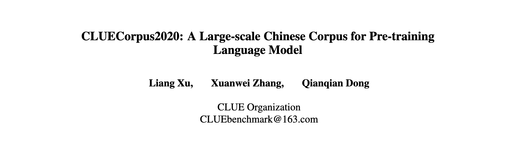

# CLUECorpus2020

## 语料介绍

通过对<a href='http://commoncrawl.org'>Common Crawl</a>的中文部分进行语料清洗，最终得到100GB的高质量中文预训练语料。实验产出的模型见：<a href='https://github.com/CLUEbenchmark/CLUEPretrainedModels'>高质量中文预训练模型，大号、超小和相似度预训练模型。</a> 

**更多细节请参考我们的技术报告 <a href='https://arxiv.org/pdf/2003.01355'>https://arxiv.org/pdf/2003.01355</a>**

#### 数据特点：
1. 可直接用于预训练、语言模型或语言生成任务。
2. 发布专用于简体中文NLP任务的小词表。

## 词表介绍

Google原始中文词表和我们发布的小词表的统计信息如下：

| Token Type | Google | CLUE |
| :----:| :----: | :----: |
| Simplified Chinese | 11378 | 5689 |
| Traditional Chinese | 3264 | ✗ |
| English | 3529 | 1320 |
| Japanese | 573 | ✗ |
| Korean | 84 | ✗ |
| Emoji | 56 | ✗ |
| Numbers | 1179 | 140 |
| Special Tokens | 106 | 106 |
| Other Tokens | 959 | 766 |
| Total | 21128 | 8021 |

## 实验效果

使用小数据集在BERT-base上的效果对比：

| Model        | Vocab  | Data        | Steps | AFQMC  | TNEWS'  | IFLYTEK'  | CMNLI  |  AVG   |
| :----:| :----: | :----: | :----: |:----: |:----: |:----: |:----: |:----: |
| BERT-base    | Google | Wiki (1 GB) | 125K  | 69.93% | 54.77%  | 57.54%    | 75.64% | 64.47% |
| BERT-base    | Google | C5 (1 GB)   | 125K  | 69.63% | 55.72%  | 58.87%    | 75.75% | 64.99% |
| BERT-base    | CLUE   | C5 (1 GB)   | 125K  | 69.00% | 55.04%  | 59.07%    | 75.84% | 64.74% |
| BERT-base mm | Google | C5 (1 GB)   | 125K  | 69.57% | 55.17%  | 59.69%    | 75.86% | 65.07% |
| BERT-base    | Google | C5 (1 GB)   | 375K  | 69.85% | 55.97%  | 59.62%    | 76.41% | 65.46% |
| BERT-base    | CLUE   | C5 (1 GB)   | 375K  | 69.93% | 56.38%  | 59.35%    | 76.58% | 65.56% |
| BERT-base    | Google | C5 (3 GB)   | 375K  | 70.22% | 56.41%  | 59.58%    | 76.70% | 65.73% |
| BERT-base    | CLUE   | C5 (3 GB)   | 375K  | 69.49% | 55.97%  | 60.12%    | 77.66% | 65.81% |

更多实验结果和分析可以参考：<a href='https://github.com/CLUEbenchmark/CLUEPretrainedModels'>CLUEPretrainedModels</a>

## 数据下载

申请方式：
将使用语料研究目的和用途，计划、研究机构和申请者介绍，发送到邮箱，并承诺不向第三方提供。

邮箱: CLUEbenchmark@163.com，标题是：CLUECorpus2020 200G语料库

# CLUECorpusSmall（14G）

可用于语言建模、预训练或生成型任务等，数据量超过14G，近4000个定义良好的txt文件、50亿个字。主要部分来自于<a href="https://github.com/brightmart/nlp_chinese_corpus">nlp_chinese_corpus项目</a>

当前语料库按照【预训练格式】处理，内含有多个文件夹；每个文件夹有许多不超过4M大小的小文件，文件格式符合预训练格式：每句话一行，文档间空行隔开。

包含如下子语料库（总共14G语料）：

1、<a href="https://pan.baidu.com/s/195M7H5w3N8shYlqCjVL0_Q">新闻语料 news2016zh_corpus</a>: 8G语料，分成两个上下两部分，总共有2000个小文件。  密码:mzlk

2、<a href="https://pan.baidu.com/s/1Vk2PihMiZNmWvA2agPb1iA">社区互动-语料 webText2019zh_corpus</a>：3G语料，包含3G文本，总共有900多个小文件。 密码:qvlq

3、<a href="https://pan.baidu.com/s/122sax9QujO8SUdV3jH5mTQ">维基百科-语料 wiki2019zh_corpus</a>：1.1G左右文本，包含300左右小文件。  密码:xv7e

4、<a href="https://pan.baidu.com/s/18-ufaJJtf7ullzHMWXvhFw">评论数据-语料 comments2019zh_corpus</a>：2.3G左右文本，共784个小文件，包括点评评论547个、亚马逊评论227个，合并<a href="https://github.com/InsaneLife/ChineseNLPCorpus">ChineseNLPCorpus</a>的多个评论数据，清洗、格式转换、拆分成小文件。  密码:gc3m

## 反馈和支持

可以提交issue，加入讨论群(QQ:836811304)

或发送邮件 CLUEbenchmark@163.com

Research supported with Cloud TPUs from Google's TensorFlow Research Cloud (TFRC)

## 引用

    @article{CLUECorpus2020,
      title={CLUECorpus2020: A Large-scale Chinese Corpus for Pre-training Language Model},
      author={Liang Xu and Xuanwei Zhang and Qianqian Dong},
      journal={ArXiv},
      year={2020},
      volume={abs/2003.01355}
    }

## 捐赠

CLUE是一个致力于中文自然语言处理的开源组织，如果您觉得我们的工作对您的学习或者业务等有帮助，希望能得到您的赞助，以便我们后续为大家提供更多更有用的开源工作，让我们一起为中文自然语言处理的发展和进步，尽一份力～

**请备注捐赠者机构和姓名，非常感谢！**

<table>
  <tr>
    <th width="30%">支付宝</th>
    <th width="30%">微信</th>
  </tr>
  <tr></tr>
  <tr align="center">
    <td></td>
    <td></td>
  </tr>
</table>
